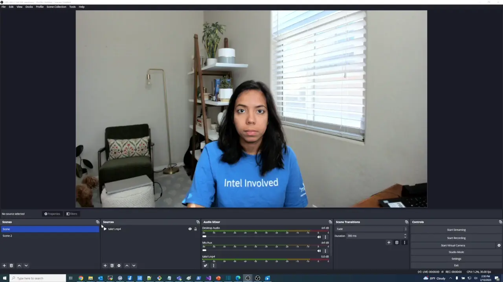
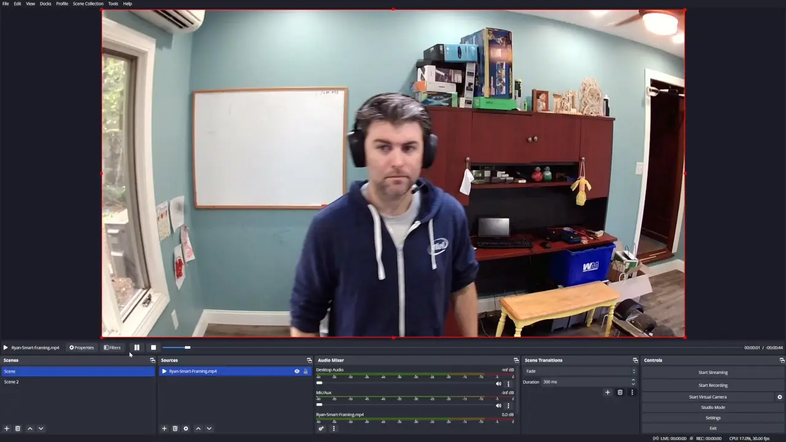
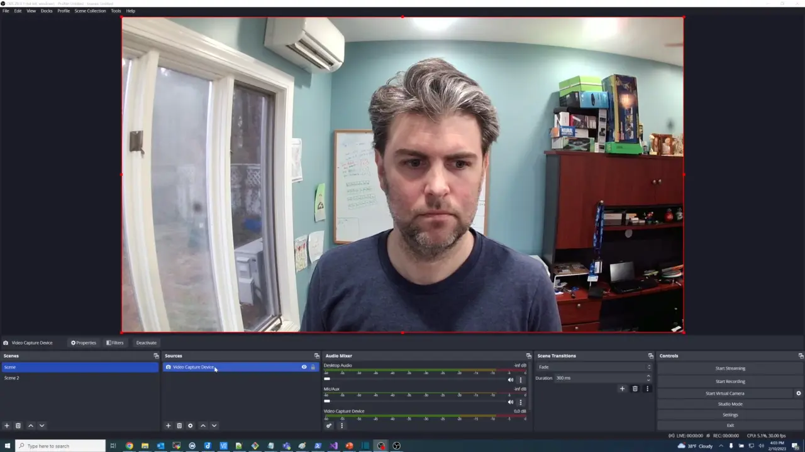

# OpenVINO™ Plugins for OBS Studio

## Current list of plugins 

**Smart Framing** - Detect person(s) / face(s) in a scene, and automatically crop / center / resize around the subjects of interest.
 

**Background Concealment** – Segment a person in the foreground from background, and allow background to be removed via blur, static image, or virtual green sceen (for chroma keying).
 

**Face Mesh** – Performs Mediapipe's face mesh pipeline using OpenVINO & OpenCV. Overlays 468 facial key-points onto resultant frame. The intent is a reference / starting point for developers wanting to implement broader face effects.
 

More plugins coming soon! Contributions are welcome!

## Objectives
[1] Provides a set of OpenVINO™ based plugins that add AI features to OBS Studio. 

[2] Serve as a reference code for how to make use of OpenVINO™ in a real-time video application requiring sustained inference, taking advantage of host xPU accelerators (e.g. CPU, GPU).

## For Windows Installation -- Go to [Release](https://github.com/intel/openvino-plugins-for-obs-studio/releases) page to find latest set of packages & installation instructions.

For Linux, you can build / install from source. See below instructions.


## How to Build & Install OpenVINO™ Plugins for OBS Studio from Source
   
### Windows Procedure
    
In order to build these plugins for windows, you need to first build obs-studio from source by following these instructions: https://github.com/obsproject/obs-studio/wiki/build-instructions-for-windows 
    
You also need to have OpenVINO™ installed. You can find instructions to download latest C/C++ runtime from the release page here:
https://github.com/openvinotoolkit/openvino/releases

Finally, you will need to download and extract OpenCV for Windows. This is the recommended version:
https://github.com/opencv/opencv/releases/tag/4.7.0

```
:::::::::::::::::::::::
:: Environment Setup ::
:::::::::::::::::::::::
:: Open a cmd-terminal (cmd.exe), and set up OpenVINO, OpenCV, and libobs environment:

:: OpenVINO
cd C:\Path\To\w_openvino_toolkit_windows_2022.3.X.X\
setupvars.bat

:: OpenCV
set OpenCV_DIR=C:\Path\To\opencv\build
set Path=%OpenCV_DIR%\x64\vc16\bin;%Path%

:: libobs
set libobs_DIR=C:\Path\To\OBS\obs-studio\build64\libobs
set w32-pthreads_DIR=C:\Path\To\OBS\obs-studio\build64\deps\w32-pthreads

:::::::::::
:: Build ::
:::::::::::
:: Use provided build.bat script to perform out-of-source build:
cd openvino-plugins-for-obs-studio
build.bat -b D:\Your\Build\Workspace\openvino-obs-plugins-build 

:::::::::::::
:: Install ::
::::::::::::: 

:: Install the built plugin DLL's to the OBS plugins directory
copy /y D:\Your\Build\Workspace\openvino-obs-plugins-build\intel64\Release\*.dll C:\Path\To\OBS_Install\obs-studio\obs-plugins\64bit

:: Install the required openvino-models directory to the OBS data directory
Xcopy /E /I openvino-models C:\Path\To\OBS_Install\obs-studio\data\obs-plugins\openvino-models

```

### Linux Procedure (Tested on Ubuntu 20.04/22.04)

```
mkdir OV_OBS_Plugins_Build_Env
cd OV_OBS_Plugins_Build_Env

#######################
## Environment Setup ##
#######################

# Install / set up OpenVINO dependencies
wget https://storage.openvinotoolkit.org/repositories/openvino/packages/2022.3/linux/l_openvino_toolkit_ubuntu20_2022.3.0.9052.9752fafe8eb_x86_64.tgz
tar xzvf l_openvino_toolkit_ubuntu20_2022.3.0.9052.9752fafe8eb_x86_64.tgz
cd l_openvino_toolkit_ubuntu20_2022.3.0.9052.9752fafe8eb_x86_64/
source ./setupvars.sh
cd ..

# Install OpenCV build dependencies
sudo apt install opencv-devel
(libopencv-dev for 22.04)

# Install OBS & libobs build dependencies.
# Download appropriate .deb package for the version of Ubuntu that you're on. (focal for 20.04, jammy for 22.04)
# These .deb packages can be downloaded from OBS github release page, for example: https://github.com/obsproject/obs-studio/releases/tag/28.1.2
sudo apt install ./obs-studio_28.1.2-0obsproject1_focal_amd64.deb


###########
## Build ##
###########
# Create a build directory outside of OpenVINO OBS plugins source directory
mkdir openvino-plugins-for-obs-studio-build
cd openvino-plugins-for-obs-studio-build

# Run cmake, pointing it to the path where you cloned this repo
cmake /path/to/openvino-plugins-for-obs-studio

# Build it
make -j 4

#############
## Install ##
#############

# Install the built .so's to the OBS plugins directory
sudo cp /path/to/openvino-plugins-for-obs-studio-build/intel64/Release/lib/*.so /usr/lib/x86_64-linux-gnu/obs-plugins/

# Install the required openvino-models directory to the obs-plugins share directory
sudo mkdir /usr/share/obs/obs-plugins/obs-smart-framing-ov
sudo mkdir /usr/share/obs/obs-plugins/obs-face-mesh-ov
sudo mkdir /usr/share/obs/obs-plugins/obs-backgroundconcealment-ov
sudo cp -R openvino-models /usr/share/obs/obs-plugins/

``` 
